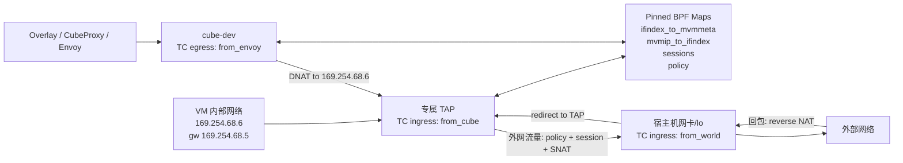

CubeSandbox 面向的是高频创建、暂停、恢复和销毁的 agent sandbox。与传统长生命周期 VM 不同，这类 sandbox 在大多数情况下会从 snapshot 恢复启动。snapshot 恢复的核心价值是复用已经初始化好的 VM 状态：操作系统、运行时、文件系统缓存、进程环境以及网络设备状态都可以被保留下来。也正因为如此，VM 内部的网卡在恢复时很可能已经拥有一个固定 IP，例如本文后面会反复出现的 `169.254.68.6`。

这带来一个非常实际的网络问题：如果所有 sandbox 都从同一个 snapshot 恢复，它们在 VM 内部看到的网卡 IP 很可能相同；但在宿主机、代理层和外部网络看来，每个 sandbox 又必须具备不同的网络身份，以便实现隔离、路由、端口映射、网络策略和审计。直接在 VM 内部重新配置网卡当然可以解决这个问题，但这往往意味着热插网卡、重新下发 IP、触发 guest 内网络栈重配置，甚至处理 DHCP、路由、ARP 缓存和应用侧网络状态变化。这些操作既昂贵，也会削弱 snapshot 快速恢复的收益。

CubeVS 的核心价值就在于避免把这部分复杂度推回 VM 内部。它允许 sandbox 在 VM 内继续使用 snapshot 中已有的相同 IP 和网关配置，然后在宿主机侧通过 eBPF 做一层身份转换：VM 内部仍然看到 `169.254.68.6`，但包一进入宿主机 TAP，CubeVS 就根据 TAP ifindex 找到对应 sandbox 的元数据，把这个相同的内部 IP 转换为外部可区分的 sandbox 逻辑 IP，并在需要出网时进一步转换为节点侧 SNAT 地址。

因此，CubeSandbox 的网络层不是用传统 Linux bridge、iptables 或 OVS 来给每个 sandbox/VM 织一张独立二层网络，而是在 VM TAP、宿主机网卡、`cube-dev` 这几个边界点挂载 eBPF 程序，把转发、ARP 代理、SNAT/DNAT、端口映射、会话追踪和网络策略都放到内核态完成。它的目标不是做一套通用虚拟网络平台，而是服务一个很明确的需求：**在不修改 snapshot 内 VM 网卡配置的前提下，让内部网络完全相同的 sandbox 在外部呈现为可区分、可隔离、可编排的网络实体。**

本文分析的代码位于仓库实际目录 `CubeNet/` 下，其中：

- `CubeNet/src/` 是 eBPF C 数据面代码；
- `CubeNet/cubevs/` 是 Go 控制面库，负责加载 BPF 对象、固定 map、挂载 TC 过滤器、注册 TAP、配置策略和回收会话。

> 版本说明：仓库里的 `docs/architecture/network.md` 提到过 `filter_from_cube` XDP 程序，但当前 `CubeNet/src/` 和 `CubeNet/cubevs/` 实际代码中只看到三个 TC 程序：`from_cube`、`from_world`、`from_envoy`。因此本文以当前代码为准。

## 0. 先建立直觉：这个方案解决了什么问题

如果读者没有做过虚拟化网络，可以先把问题简化成一句话：

> CubeSandbox 希望每个从 snapshot 恢复的 VM 都能继续使用同一套内部网络配置，但在宿主机和外部系统看来，它们又必须是彼此隔离、可寻址、可管控的不同 sandbox。

这听起来有点矛盾。VM 内部如果都用同一个 IP，例如都是 `169.254.68.6`，那宿主机如何区分“A 沙箱的 169.254.68.6”和“B 沙箱的 169.254.68.6”？一种思路是在恢复后修改 VM 内部网络配置，或者给 VM 热插新的网卡，再让 guest 感知新的地址。但对 snapshot 启动来说，这类动作会拉长恢复路径，也会引入 guest 内网络状态变更，复杂度和失败面都比较高。另一类传统做法则会把复杂度放在网络命名空间、bridge、iptables、路由规则或者用户态代理里。它们能工作，但对一个高频创建和销毁的 agent sandbox 系统来说，规则多、链路长、状态散，最后很容易变成一套难以观测和调优的网络拼图。

CubeVS 的想法更像是：不要让 VM 自己携带复杂身份。VM 只负责发包，宿主机在包离开 VM 的第一跳，也就是 TAP ingress 上，用 eBPF 给这个包“盖章”。这个章不是根据 VM 内部 IP 盖的，因为所有 VM 内部 IP 都一样；它根据 **TAP ifindex** 盖。每个 VM 都有自己的 TAP 设备，所以 TAP ifindex 天然可以作为 sandbox 的入口身份。

可以把一次出站访问理解成三层身份翻译：

| 所在位置 | 包里看到的源身份 | 谁负责翻译 | 为什么这样设计 |
|---|---|---|---|
| VM 内部 | `169.254.68.6` | VM 自己的网络栈 | 镜像和网络配置可以完全复用 |
| 宿主机虚拟网络内 | `mvm_meta->ip` | `from_cube` 根据 TAP ifindex 查 map | 编排层能区分不同 sandbox |
| 真正出外网时 | `snat_iplist` 里的节点 SNAT IP + 动态端口 | `from_cube` 的 NAT/session 逻辑 | 外部网络只需要看到可路由的节点侧地址 |

反方向也是类似的。外部回包先到宿主机网卡，`from_world` 根据 NAT 会话表找到对应 TAP，再把目标地址改回 VM 熟悉的 `169.254.68.6`。来自 overlay/proxy 的流量则从 `cube-dev` 进入，`from_envoy` 根据 sandbox 逻辑 IP 找到 TAP，也改写成 VM 内部地址后送进去。

所以 CubeVS 的精妙之处不只是“用了 eBPF”。它真正有价值的地方在于把身份转换放在了最合适的位置：

- **VM 内部保持单纯**：所有 sandbox 可以共享同一套网络配置；
- **宿主机掌握真实身份**：TAP ifindex 和 BPF map 决定包属于哪个 sandbox；
- **数据面不出内核**：策略、NAT、端口映射和重定向都在 TC eBPF 里完成；
- **控制面只管慢路径**：Go 代码负责加载程序、填 map、挂载过滤器、清理会话。

带着这个直觉再看后面的代码，会更容易理解：那些 map、NAT、checksum、redirect 其实都在服务同一件事，即让“内部完全一样的 VM”在外部表现成“可区分、可隔离、可编排的 sandbox”。

为了降低阅读门槛，先把文中几个高频词放在这里：

| 术语 | 可以先这样理解 |
|---|---|
| TAP | VM 接到宿主机的一根虚拟网线。每个 sandbox 有自己的 TAP，所以 TAP ifindex 可以代表 sandbox 来源 |
| TC | Linux 网卡收发包路径上的可编程挂载点。CubeVS 把 eBPF 程序挂在 TC ingress/egress 上处理包 |
| eBPF map | 内核里的共享表。Go 控制面写入配置，eBPF 数据面按包查表 |
| SNAT | 改写源地址。VM 发出去的包会从内部 IP 改成 sandbox 逻辑 IP，再改成节点侧出网 IP |
| DNAT | 改写目的地址。回到 VM 的包会从外部/逻辑目标地址改回 `169.254.68.6` |
| `bpf_redirect` | eBPF 告诉内核“这个包不要按默认路径走，直接送到指定接口” |

还可以用一条 HTTP 请求的旅程来记住整套方案：

1. VM 进程访问 `example.com`，包的源地址是固定的 `169.254.68.6`。
2. 包离开 VM 后进入专属 TAP，`from_cube` 看到 TAP ifindex，查出这个 VM 对应的 sandbox 逻辑 IP。
3. `from_cube` 先把源地址从 `169.254.68.6` 改成 sandbox 逻辑 IP，再检查网络策略。
4. 如果策略允许，`from_cube` 分配 SNAT 端口，创建 NAT 会话，把源地址改成节点侧 SNAT IP，送到宿主机网卡。
5. 外部服务器回包到节点侧 SNAT IP 和端口，`from_world` 在宿主机网卡上查会话表。
6. `from_world` 找到原 TAP，把目的地址和端口改回 `169.254.68.6:原始端口`，再 redirect 回 VM。

这条路径里没有 Linux bridge 的集中转发，也没有每个包进入用户态代理。包在内核里一路被“查表、改头、转发”，这就是 CubeVS 的性能和简洁性来源。

## 1. 核心模型：相同 VM 内部网络，不同宿主机侧身份

CubeVS 的关键常量定义在 `CubeNet/src/cubevs.h`。这几个地址说明了设计意图：

```c
/* IP and MAC address inside MVMs */
const volatile __u32 mvm_inner_ip       = 0x0644fea9; /* 169.254.68.6 */

/* next hop of MVM */
const volatile __u32 mvm_gateway_ip     = 0x0544fea9; /* 169.254.68.5 */

/* cube-dev device */
const volatile __u32 cubegw0_ip         = 0x017100cb; /* 203.0.113.1 */
const volatile __u32 cubegw0_ifindex    = 216;

/* Node itself; MAC 地址常量略 */
const volatile __u32 nodenic_ip         = 0x020a8709; /* 9.135.10.2 */
const volatile __u32 nodenic_ifindex    = 2;
```

注意这些变量都是 `const volatile`。它们在 C 源码里看起来像编译期常量，但 Go loader 会在加载 BPF object 之前把它们改写成当前宿主机真实的 IP、MAC 和 ifindex。这样做有两个好处：

1. eBPF 程序里不需要每个包都查配置 map；
2. 同一份 BPF object 可以适配不同节点。

Go 侧改写逻辑在 `CubeNet/cubevs/miscs.go`：

```go
func rewriteConstants(vars map[string]*ebpf.VariableSpec, params Params) error {
	vars[globalNameMVMInnerIP].Set(ipToUint32(params.MVMInnerIP))
	vars[globalNameMVMGatewayIP].Set(ipToUint32(params.MVMGatewayIP))
	vars[globalNameCubegw0IP].Set(ipToUint32(params.Cubegw0IP))
	vars[globalNameNodeIP].Set(ipToUint32(params.NodeIP))
	/* ...MAC、ifindex 和错误聚合略... */
}
```

于是，VM 内部始终可以使用同一套网络配置；真正区分 sandbox 的，是宿主机侧 TAP ifindex、sandbox 元数据以及 eBPF map。

这里要特别强调 `const volatile` 的意义。对没有 eBPF 背景的读者来说，可以把它理解成“加载时写入的常量”：代码编译出来时带着默认值，但真正加载到内核前，Go 控制面会把默认值替换成当前机器的真实网卡、网关和 MAC。这样数据面运行时就像读常量一样快，同时部署时又不需要为每台机器重新编译 BPF 程序。

另一个容易忽略的点是：`mvm_inner_ip` 和 `mvm_meta->ip` 不是同一层身份。`mvm_inner_ip` 是 VM 内部统一看到的地址；`mvm_meta->ip` 是 CubeSandbox 编排层分配给某个 sandbox 的逻辑地址。`from_cube` 入口处先把前者改成后者，这就是整套方案的第一道“身份翻译门”。

## 2. 三个 eBPF 程序构成一台“虚拟交换机”

CubeVS 没有集中式 bridge，而是在三类接口边界挂载 TC 程序：

| 程序 | 文件 | 挂载点 | 方向 | 主要职责 |
|---|---|---|---|---|
| `from_cube` | `CubeNet/src/mvmtap.bpf.c` | 每个 TAP 的 TC ingress | VM -> 宿主机 | ARP 代理、策略检查、端口映射优化、SNAT、会话创建 |
| `from_world` | `CubeNet/src/nodenic.bpf.c` | 宿主机网卡 TC ingress，另挂到 lo | 外部 -> VM | 回包反向 NAT、远端端口映射 |
| `from_envoy` | `CubeNet/src/localgw.bpf.c` | `cube-dev` TC egress | overlay/proxy -> VM | 把目标 sandbox 逻辑 IP DNAT 成 VM 内部 IP 并转发到 TAP |

初始化流程在 `CubeNet/cubevs/miscs.go`：

```go
func Init(params Params) error {
	/* 加载并固定三个 BPF object */
	loadObject(params, loadLocalgw, "loadLocalgw")
	loadObject(params, loadMvmtap, "loadMvmtap")
	loadObject(params, loadNodenic, "loadNodenic")

	/* 把程序挂到关键网络边界 */
	attachTCFilter(programNameFromEnvoy, params.Cubegw0Ifindex, TCEgress)
	attachTCFilter(programNameFromWorld, params.NodeIfindex, TCIngress)
	attachTCFilter(programNameFromWorld, 1, TCIngress)

	/* ...错误处理略... */
}
```

这里的 `loadObject` 会加载 BPF object，并把 map pin 到 `/sys/fs/bpf`：

```go
spec, err := loader()
err = rewriteConstants(spec.Variables, params)
obj, err := ebpf.NewCollectionWithOptions(spec, opts)
return pinProgs(obj)

/* opts.Maps.PinPath = "/sys/fs/bpf"，错误处理略 */
```

### 2.1 挂载网卡是怎么控制的

TC eBPF 并不是“加载后自动影响所有网卡”。当前代码里，程序挂到哪个网络设备，完全由传入的 **ifindex** 决定。`attachTCFilter` 的核心就是把 `ifindex` 写进 TC netlink 对象：

```go
filter := tc.Object{
	Msg: tc.Msg{
		Ifindex: ifindex,
		Parent:  tcMakeHandle(tcHandleClsact, uint32(direction)),
	},
	Attribute: tc.Attribute{
		Kind: "bpf",
		BPF:  &tc.Bpf{FD: &progFD, Name: &progName, Flags: &flags},
	},
}
tcnl.Filter().Replace(&filter)
```

挂载前还会在同一个 ifindex 上创建 `clsact` qdisc。`clsact` 可以理解成 TC 专门给 ingress/egress filter 准备的轻量挂载容器：

```go
qdisc := tc.Object{
	Msg: tc.Msg{Ifindex: ifindex, Parent: tcHandleClsact},
	Attribute: tc.Attribute{Kind: "clsact"},
}
tcnl.Qdisc().Add(&qdisc)
```

所以 CubeVS 的挂载控制粒度是网络设备级别：

| 挂载动作 | ifindex 来源 | 是否可控 |
|---|---|---|
| `from_envoy` 挂到 `cube-dev` egress | `params.Cubegw0Ifindex` | 可通过初始化参数控制 |
| `from_world` 挂到 Node 网卡 ingress | `params.NodeIfindex` | 可通过初始化参数控制 |
| `from_world` 挂到 lo ingress | 固定 `1` | 当前代码写死 |
| `from_cube` 挂到 TAP ingress | `AttachFilter(ifindex)` 的参数 | 创建/注册 TAP 时控制 |

这也意味着，如果不希望硬件网卡被挂载 TC eBPF，就不能把 `Params.NodeIfindex` 设置成物理网卡的 ifindex。更理想的做法是给 CubeVS 准备一个专用的虚拟出入口设备，例如 veth、dummy、macvlan、ipvlan 或独立的 gateway 设备，让 SNAT IP、路由回包路径和 `from_world` 都落在这张设备上。

但这里有一个前提：外部回包必须真的从这个设备的 ingress 经过。`from_world` 负责反向 NAT，如果回包仍然直接进入物理网卡，而 `from_world` 没挂在那里，那回包就不会被改回 `169.254.68.6` 并重定向到 TAP。

因此，避免影响主硬件网卡性能通常有两条路：

1. **拓扑上隔离**：让 CubeVS 的 SNAT IP 和回包路由走专用虚拟设备或独立网卡，再把 `Params.NodeIfindex` 指向它。
2. **控制面改造**：把 `Init()` 中的 `from_world` 挂载从单个 `params.NodeIfindex` 改成显式列表，例如 `WorldIfindexes []uint32`，只挂到用户指定的设备上。

后者可以把当前代码改成类似这样：

```go
for _, ifindex := range params.WorldIfindexes {
	attachTCFilter(programNameFromWorld, ifindex, TCIngress)
}
```

需要注意的是，即使挂在硬件网卡上，`from_world` 也不是对所有流量都做完整 NAT；它会先检查 IPv4 和协议，再查 session 或端口映射。但程序仍然会在该网卡 ingress 路径上被触发，开销不是零。如果宿主机主网卡承载了大量与 sandbox 无关的业务流量，把 CubeVS 的入口拆到专用设备上会更干净。

每个新 TAP 创建后，还需要把 `from_cube` 挂到这个 TAP 的 ingress：

```go
func AttachFilter(ifindex uint32) error {
	prog, err := ebpf.LoadPinnedProgram(pinPath(programNameFromCube), nil)
	createQdisc(ifindex)
	attachFilter(ifindex, uint32(prog.FD()), programNameFromCube, TCIngress)
	return initNetPolicy(ifindex)

	/* ...错误处理和资源释放略... */
}
```

这就是 CubeVS 的“交换机端口”模型：每个 TAP 是一个接入口，`cube-dev` 是 overlay 网关口，宿主机网卡是外部网络口，TC 程序是交换逻辑。

如果用普通交换机来类比，CubeVS 并不是一台只看 MAC 地址的二层交换机。它更像一台“带 NAT、防火墙和服务发布能力的可编程边界设备”：

- TAP 端口接 VM，负责识别这个包来自哪个 sandbox；
- `cube-dev` 端口接本地 overlay/proxy，负责把逻辑 sandbox IP 翻译回 VM 内部 IP；
- 宿主机网卡端口接外部网络，负责处理回包和端口映射；
- BPF map 就是这台设备的转发表、会话表、策略表。

这些逻辑如果放在用户态代理里，理解起来也许更直观，但每个包都要跨用户态和内核态边界。CubeVS 选择把它们放到 TC hook 上，代价是代码更接近内核网络栈，收益是路径短、状态集中、规则数量不会随着 sandbox 数量线性膨胀到 iptables 链上。

## 3. BPF Map：虚拟交换机的转发表、NAT 表和策略表

核心 map 定义在 `CubeNet/src/map.h`。先看两个最关键的设备身份映射：

```c
struct {
	__uint(type, BPF_MAP_TYPE_HASH);
	__type(key, __u32);
	__type(value, __u32);
	__uint(pinning, LIBBPF_PIN_BY_NAME);
} mvmip_to_ifindex SEC(".maps");

struct {
	__uint(type, BPF_MAP_TYPE_HASH);
	__type(key, __u32);
	__type(value, struct mvm_meta);
	__uint(pinning, LIBBPF_PIN_BY_NAME);
} ifindex_to_mvmmeta SEC(".maps");
```

`mvmip_to_ifindex` 用于从 sandbox 逻辑 IP 找 TAP；`ifindex_to_mvmmeta` 用于从 TAP 找 sandbox 元数据。Go 侧 `AddTAPDevice` 注册这两张表：

```go
func AddTAPDevice(ifindex uint32, ip net.IP, id string, version uint32, opts MVMOptions) error {
	mvmIP := ipToUint32(ip)
	mvmID := mvmMetadata{IP: mvmIP, UUID: stringToByteArray(id), Version: version}

	ifindexToMVMMeta.Update(&ifindex, &mvmID, ebpf.UpdateAny)
	mvmIPToIfindex.Update(&mvmIP, &ifindex, ebpf.UpdateAny)
	return applyNetPolicy(ifindex, opts)

	/* ...loadPinnedMap 和错误处理略... */
}
```

再看 NAT 和端口映射相关 map：

```c
struct { /* host_port -> (TAP ifindex, VM listen_port) */
	__type(key, __u16);
	__type(value, struct mvm_port);
} remote_port_mapping SEC(".maps");

struct { /* sandbox-side 5-tuple -> NAT state */
	__type(key, struct session_key);
	__type(value, struct nat_session);
} egress_sessions SEC(".maps");

struct { /* hash(mvm_ip) -> SNAT IP entry */
	__uint(max_entries, MAX_SNAT_IPS);
	__type(value, struct snat_ip);
} snat_iplist SEC(".maps");
```

可以把这些 map 理解成虚拟交换机里的几类表：

- `ifindex_to_mvmmeta`：接入口到 VM 身份的映射；
- `mvmip_to_ifindex`：VM 逻辑 IP 到接入口的映射；
- `egress_sessions` / `ingress_sessions`：双向 NAT 会话表；
- `snat_iplist`：出公网 SNAT 地址池；
- `remote_port_mapping` / `local_port_mapping`：服务端口映射表；
- `allow_out` / `deny_out`：逐 sandbox 出站策略表。

## 4. 出站路径：VM 内部同 IP，出 TAP 后改写为 sandbox 逻辑 IP

VM 发出的包首先进入 TAP 的 TC ingress，也就是 `from_cube`。入口函数在 `CubeNet/src/mvmtap.bpf.c`：

```c
SEC("tc")
int from_cube(struct __sk_buff *skb)
{
	if (skb->protocol == bpf_htons(ETH_P_ARP))
		return handle_arp(skb, skb->ingress_ifindex);

	ifindex = skb->ingress_ifindex;
	mvm_meta = bpf_map_lookup_elem(&ifindex_to_mvmmeta, &ifindex);

	/* ...过滤非 IP 包，解析 L2/L3 头，读取目的地址和协议... */
	daddr = l3->daddr;
	proto = l3->protocol;

	/* 第一道身份翻译：VM 内部 IP -> sandbox 逻辑 IP */
	err = snat(skb, l3, mvm_meta->ip);
	/* ...后续进入 gateway、端口映射、策略和 NAT 分支... */
}
```

这里最关键的动作就是 `snat(skb, l3, mvm_meta->ip)`。

VM 内部包的源地址原本是固定的 `mvm_inner_ip`，也就是 `169.254.68.6`。进入 TAP 后，`from_cube` 通过 `skb->ingress_ifindex` 找到 `mvm_meta`，然后先把源地址改成该 sandbox 的逻辑 IP。

这一步解释了“所有 VM 内部都是同一个 IP，但宿主机侧看到的是不同 IP”的核心机制：VM 里的网络栈不需要知道自己是谁；TAP ifindex 才是身份锚点；eBPF 在第一跳把统一的内部身份翻译成编排层分配的 sandbox 身份。

### 4.1 ARP 代理：网关并不真实存在

VM 会把 `169.254.68.5` 当默认网关，因此它会先发 ARP 请求。这个网关不一定是一个真实三层设备，而是由 `from_cube` 代理回答：

```c
static __always_inline int handle_arp(struct __sk_buff *skb, __u32 ifindex)
{
	/* 只处理 Ethernet/IPv4 ARP request */
	if (arp->ar_hrd != bpf_htons(ARPHRD_ETHER) ||
	    arp->ar_op != bpf_htons(ARPOP_REQUEST))
		return TC_ACT_SHOT;

	/* request 原地改 reply：交换 sender/target IP */
	arp->ar_op = bpf_htons(ARPOP_REPLY);
	/* ...交换 ar_sip/ar_tip，回填目标 MAC... */

	/* 用 gateway MAC 作为 ARP reply 的 sender */
	macaddr->p1 = cubegw0_macaddr_p1;
	macaddr->p2 = cubegw0_macaddr_p2;

	return bpf_redirect(ifindex, 0);
}
```

这段代码把 ARP request 原地改成 ARP reply，再 redirect 回同一个 TAP。VM 于是认为默认网关存在，并继续发送 IP 包。

### 4.2 到 gateway 的流量：转到 cube-dev

如果 VM 目的地址是 `mvm_gateway_ip`，`from_cube` 会把目的地址改成 `cubegw0_ip`，然后把包重定向到 `cube-dev`：

```c
if (daddr == mvm_gateway_ip) {
	/* gateway 通路只允许 ICMP 和非首包 TCP */
	if (proto != IPPROTO_ICMP && !(proto == IPPROTO_TCP && !(l4->syn && !l4->ack)))
		return TC_ACT_SHOT;

	/* 目标从 VM 看到的 gateway 改成 cube-dev */
	err = dnat(skb, l3, cubegw0_ip);
	return bpf_redirect(cubegw0_ifindex, BPF_F_INGRESS);

	/* ...拉取 TCP 头和错误处理略；源码中用 switch 展开... */
}
```

这里的过滤也很克制：放行 ICMP 和非首包 TCP，拒绝新的 TCP SYN 和其他协议。这通常用于内部 gateway/control-plane 通路，而不是让 VM 随意连宿主机网关。

### 4.3 到外部网络：策略检查后做有状态 SNAT

普通外部流量会先被网络策略检查，核心就是 `if (!check_net_policy(ifindex, daddr)) return TC_ACT_SHOT;`。

之后根据协议进入 TCP、UDP 或 ICMP 的 NAT 逻辑：

```c
if (should_do_nat(l3)) {
	if (proto == IPPROTO_TCP)
		if (do_tcp_nat(skb, mvm_meta, &dst_ifindex))
			return bpf_redirect(dst_ifindex, 0);

	if (proto == IPPROTO_UDP)
		if (do_udp_nat(skb, mvm_meta, &dst_ifindex))
			return bpf_redirect(dst_ifindex, 0);

	if (proto == IPPROTO_ICMP)
		if (do_icmp_nat(skb, mvm_meta, &dst_ifindex))
			return bpf_redirect(dst_ifindex, 0);
}
```

TCP 的新连接只在看到 SYN 且无 ACK/FIN/RST 时创建会话：

```c
if (syn && !ack && !fin && !rst) {
	sess = bpf_map_lookup_elem(&egress_sessions, &key);
	if (sess) {
		if (sess->state == TCP_CONNTRACK_CLOSE || sess->state == TCP_CONNTRACK_TIME_WAIT) {
			del_session(&key, sess);
			goto do_create;
		}
		goto do_update; /* SYN 重传复用已有 session */
	}
do_create:
	/* 新连接：分配 SNAT 端口，并写入正反向会话表 */
	snat_ip = pick_snat_ip_port(mvm_meta->ip, &key, &snat_port);
	ok = create_new_sessions(&key, now, skb->ingress_ifindex, snat_ip, snat_port);
}
```

已有连接则直接查 `egress_sessions`，更新状态后改写 L4/L3/L2：

```c
old_buff.addr = l3->saddr;
old_buff.port = l4->source;
new_buff.addr = sess->node_ip;
new_buff.port = sess->node_port;

/* 增量更新 L4 checksum 后改源端口 */
new_csum = bpf_csum_diff((void *)&old_buff, sizeof(old_buff),
			 (void *)&new_buff, sizeof(new_buff), ~old_csum);
l4->check = csum_fold(new_csum);
l4->source = sess->node_port;

/* 改源 IP，再改二层 MAC，最后 redirect 到宿主机网卡 */
rewrite_l3_addr(l3, &l3->saddr, sess->node_ip);
set_mac_pair(l2, nodenic_macaddr_p1, nodenic_macaddr_p2,
	     nodegw_macaddr_p1, nodegw_macaddr_p2);
```

所以出站包可能经历两级身份转换：

1. `169.254.68.6` -> `mvm_meta->ip`：VM 内部统一 IP 变成 sandbox 逻辑 IP；
2. `mvm_meta->ip` -> `sess->node_ip`：真正出宿主机时变成 SNAT 地址池中的节点侧地址。

## 5. SNAT 地址池：按 sandbox 稳定选 IP，按会话分配端口

SNAT 地址池的 Go 配置入口是 `CubeNet/cubevs/snat.go`：

```go
func SetSNATIPs(ips []*SNATIP) error {
	ipList := make([]snatIP, len(ips))
	for i, ip := range ips {
		ipList[i] = snatIP{Ifindex: uint32(ip.Ifindex), IP: ipToUint32(ip.IP), MaxPort: maxPortStart}
	}
	/* 排序后写入 snat_iplist，最多填 4 个槽 */
	return setSNATIPs(ipList)
}

func setSNATIPs(ips []snatIP) error {
	for i := range maxSNATIPs {
		m.Update(uint32(i), ips[i%len(ips)], ebpf.UpdateAny)
	}
	/* ...错误处理略... */
}
```

eBPF 侧最多支持 4 个 SNAT IP：

```c
#define MAX_SNAT_IPS 4
#define MAX_PORT_START 30000

struct snat_ip {
	struct bpf_spin_lock lock; /* guard max_port */
	__u32 ifindex, ip;
	__u16 max_port;          /* the next port to be used */
	/* ...padding 略... */
};
```

端口分配在 `pick_snat_ip_port` 中完成：

```c
index = jhash_1word(mvm_ip, HASH_SEED) % MAX_SNAT_IPS;
snat_ip = bpf_map_lookup_elem(&snat_iplist, &index);

for (i = 0; i < max_retries; i++) {
	/* 用 spin lock 保护端口水位线 */
	bpf_spin_lock(&snat_ip->lock);
	snat_port = snat_ip->max_port;
	snat_ip->max_port = (snat_ip->max_port == 0xffff) ? MAX_PORT_START : snat_ip->max_port + 1;
	bpf_spin_unlock(&snat_ip->lock);

	/* BPF_NOEXIST 抢占反向 NAT key，避免端口碰撞 */
	ikey.dst_port = bpf_htons(snat_port);
	if (!bpf_map_update_elem(&ingress_sessions, &ikey, &isess, BPF_NOEXIST))
		return snat_ip;
}
```

这里有几个设计点：

- SNAT IP 通过 `jhash(mvm_ip) % MAX_SNAT_IPS` 选择，同一个 sandbox 逻辑 IP 会稳定落到同一个 SNAT IP 槽位；
- 每个 SNAT IP 维护一个 `max_port` 水位线，从 `30000` 起分配；
- `bpf_spin_lock` 保证多 CPU 并发分配端口时不会踩踏；
- `BPF_NOEXIST` 抢占 `ingress_sessions` key，避免两个连接拿到同一个反向 NAT 坐标；
- 最多重试 10 次，失败则丢包。

这比为每个 VM 生成 iptables 规则轻得多：数据面只做 map 查找、校验和增量更新和 `bpf_redirect`。

## 6. 回包路径：从宿主机网卡反查会话并送回 TAP

外部回包从宿主机网卡进入，命中 `from_world`：

```c
SEC("tc")
int from_world(struct __sk_buff *skb)
{
	if (l3->protocol == IPPROTO_TCP)
		return do_tcp_nat(skb);
	if (l3->protocol == IPPROTO_UDP)
		return do_udp_nat(skb);
	if (l3->protocol == IPPROTO_ICMP)
		return do_icmp_nat(skb);

	return TC_ACT_OK;

	/* ...协议过滤和 IP 头解析略... */
}
```

回包的 key 是外部视角的五元组：远端 IP、节点 SNAT IP、远端端口、节点 SNAT 端口、协议。`lookup_session` 先查 `ingress_sessions`，再还原出 `egress_sessions` 的 key：

```c
static __always_inline struct nat_session *lookup_session(const struct session_key *ikey)
{
	isess = bpf_map_lookup_elem(&ingress_sessions, ikey);
	if (!isess)
		return NULL;

	/* 用 ingress value 还原 egress_sessions 的 key */
	key.src_ip = isess->vm_ip;
	key.dst_ip = ikey->src_ip;
	key.src_port = isess->vm_port;
	key.dst_port = ikey->src_port;
	/* ...version/protocol 略... */
	return bpf_map_lookup_elem(&egress_sessions, &key);
}
```

找到会话后，目标地址和目标端口被改回 VM 内部视角：

```c
old_buff.addr = l3->daddr;
old_buff.port = l4->dest;
new_buff.addr = mvm_inner_ip;
new_buff.port = sess->vm_port;

/* 目标端口改回 VM 原始端口 */
/* ...bpf_csum_diff 更新 checksum... */
l4->dest = sess->vm_port;

/* 目标 IP 改回 169.254.68.6，再送回原 TAP */
rewrite_l3_addr(l3, &l3->daddr, mvm_inner_ip);
return bpf_redirect(sess->vm_ifindex, 0);
```

于是 VM 收到的包仍然是发给 `169.254.68.6:原始端口` 的包。它完全不知道中间发生了两次 NAT，也不需要感知宿主机上的多租户网络。

## 7. Overlay/Proxy 到 VM：`cube-dev` egress 上做 DNAT

`from_envoy` 处理的是另一条路径：来自 overlay、Envoy 或本地代理的流量，目标地址通常是 sandbox 逻辑 IP。它在 `cube-dev` 的 TC egress 上执行：

```c
SEC("tc")
int from_envoy(struct __sk_buff *skb)
{
	daddr = l3->daddr;

	/* overlay 目标 IP -> VM 内部统一 IP */
	err = dnat(skb, l3, mvm_inner_ip);

	/* 源地址伪装成 VM 默认网关 */
	err = snat(skb, l3, mvm_gateway_ip);

	/* 用原始目标 IP 找到 sandbox TAP */
	ifindex = bpf_map_lookup_elem(&mvmip_to_ifindex, &daddr);
	return bpf_redirect(*ifindex, 0);

	/* ...头解析和错误处理略... */
}
```

这段逻辑特别能体现“虚拟交换机”的味道：

1. 保存原始目的地址 `daddr`，也就是 sandbox 逻辑 IP；
2. 把目的 IP 改成 VM 内部统一地址 `mvm_inner_ip`；
3. 把源 IP 改成 VM 网关 `mvm_gateway_ip`；
4. 用原始 `daddr` 查 `mvmip_to_ifindex`，找到具体 TAP；
5. `bpf_redirect` 到该 TAP。

对于 VM 来说，包来自默认网关，目的地是自己固定的 `169.254.68.6`。对于 proxy/overlay 来说，它访问的是不同 sandbox 的不同逻辑 IP。两边看到的是两套地址空间。

## 8. 端口映射：无需用户态代理的 TCP 转发

CubeVS 支持把宿主机端口映射到 VM 内部端口。Go 侧会同时维护两张表：

```go
func AddPortMapping(ifindex uint32, listenPort uint16, hostPort uint16) error {
	listenPort = htons(listenPort)
	hostPort = htons(hostPort)
	mvmPort := MVMPort{Ifindex: ifindex, ListenPort: listenPort}

	/* host_port -> (TAP ifindex, VM listen_port) */
	err = m1.Update(&hostPort, &mvmPort, ebpf.UpdateAny)

	/* (TAP ifindex, VM listen_port) -> host_port */
	err = m2.Update(&mvmPort, &hostPort, ebpf.UpdateAny)
}
```

`remote_port_mapping` 用于外部访问宿主机端口时找到 VM：

```c
dport = l4->dest;
mvm_port = bpf_map_lookup_elem(&remote_port_mapping, &dport);
if (mvm_port)
	return tcp_nat_proxy(l2, l3, l4, mvm_port);
```

`tcp_nat_proxy` 把目的端口和目的地址改成 VM 内部监听地址：

```c
new_buff.addr = mvm_inner_ip;
new_buff.port = mvm_port->listen_port;
/* 目的端口改成 VM 监听端口 */
l4->check = csum_fold(new_csum);
l4->dest = mvm_port->listen_port;

/* 目的 IP 改成 VM 内部统一 IP，然后送到目标 TAP */
rewrite_l3_addr(l3, &l3->daddr, mvm_inner_ip);
return bpf_redirect(mvm_port->ifindex, 0);

/* ...checksum diff 和 L2 MAC 改写略... */
```

反方向也有优化。VM 如果从被映射的监听端口发包，`from_cube` 会查 `local_port_mapping`：

```c
mvm_port.ifindex = ifindex;
mvm_port.listen_port = l4->source;
host_port = bpf_map_lookup_elem(&local_port_mapping, &mvm_port);
if (host_port) {
	err = snat_tcp(skb, ifindex, l2, l3, l4, l4->source, *host_port);
	if (err)
		return TC_ACT_SHOT;

	return bpf_redirect(nodenic_ifindex, 0);
}
```

这样端口映射流量不需要完整 NAT session 创建，也不需要用户态 proxy 转发，直接在内核态完成 TCP 源端口和源地址改写。

## 9. 网络策略：Hash-of-Maps + LPM Trie

CubeVS 的出站网络策略是逐 TAP 的。C 侧 map 结构是 hash-of-maps，内层是 LPM trie：

```c
struct {
	__uint(type, BPF_MAP_TYPE_HASH_OF_MAPS);
	__type(key, __u32);
	__uint(pinning, LIBBPF_PIN_BY_NAME);

	/* value 是内层 LPM trie，用来存 CIDR */
	__array(values, struct {
		__uint(type, BPF_MAP_TYPE_LPM_TRIE);
		__type(key, struct lpm_key);
		__type(value, __u32);
		__uint(map_flags, BPF_F_NO_PREALLOC);
	});
} allow_out SEC(".maps");
```

`deny_out` 结构相同。Go 侧会为每个 ifindex 创建内层 LPM trie：

```go
func ensureInnerMap(outerMap *ebpf.Map, ifindex uint32, mapName string) error {
	err := outerMap.Lookup(&ifindex, &innerMapID)
	if err == nil {
		return nil /* 这个 TAP 已有自己的策略 trie */
	}

	inner, err := newInnerLPMMap()
	outerMap.Put(&ifindex, inner)

	/* ...错误处理和资源释放略... */
}
```

策略规则在 `applyNetPolicy` 中落表。默认会加入一组不可访问的私有/本地网段：

```go
var alwaysDeniedSandboxCIDRs = []string{
	"10.0.0.0/8", "127.0.0.0/8", "169.254.0.0/16",
	"172.16.0.0/12", "192.168.0.0/16",
}

func applyNetPolicy(ifindex uint32, opts MVMOptions) error {
	if opts.AllowInternetAccess != nil && !*opts.AllowInternetAccess {
		denyOut = []string{"0.0.0.0/0"}
	} else {
		denyOut = append(userDenyOut, alwaysDeniedSandboxCIDRs...)
	}

	/* ...把 allowOut/denyOut 写入对应内层 LPM trie... */
}
```

eBPF 数据面执行策略的顺序是 allow 优先于 deny，最后默认放行：

```c
static __always_inline bool check_net_policy(__u32 ifindex, __u32 daddr)
{
	struct lpm_key key = { .prefixlen = 32, .ip = daddr };

	if (daddr == mvm_gateway_ip)
		return true;

	/* allow 优先，然后 deny，最后默认放行 */
	inner_map = bpf_map_lookup_elem(&allow_out, &ifindex);
	if (inner_map && bpf_map_lookup_elem(inner_map, &key))
		return true;

	inner_map = bpf_map_lookup_elem(&deny_out, &ifindex);
	if (inner_map && bpf_map_lookup_elem(inner_map, &key))
		return false;

	return true;
}
```

这里有一个值得注意的细节：BPF 侧查策略时构造的 key 是 `/32`，也就是 `struct lpm_key key = { .prefixlen = 32, .ip = daddr };`。

LPM trie 的查找语义会用这个完整 IP 去匹配 map 中已插入的任意前缀，比如 `10.0.0.0/8` 或 `0.0.0.0/0`。因此策略天然支持 CIDR，而不需要 BPF 程序自己实现掩码匹配。

## 10. 会话追踪：两个 map 支撑双向 O(1) 查找

会话 key/value 结构在 `CubeNet/src/cubevs.h`：

```c
struct session_key {
	__u32 src_ip, dst_ip;
	__u16 src_port, dst_port;
	__u32 version; /* 0 for ingress session */
	__u8 protocol;
	/* ...padding 略... */
};

struct nat_session {
	__u64 access_time;
	__u32 node_ifindex, node_ip;
	__u32 vm_ifindex, vm_ip;
	__u16 node_port, vm_port;
	__u8 state, active_close;
	/* ...padding 略... */
};

struct ingress_session { __u32 version, vm_ip; __u16 vm_port; /* ... */ };
```

创建会话时，`pick_snat_ip_port` 先占住 `ingress_sessions` 的反向 key，然后 `create_nat_session` 创建正向 `egress_sessions`：

```c
static __always_inline bool create_nat_session(struct session_key *ekey,
					       __u64 now_ns, __u32 vm_ifindex,
					       struct snat_ip *snat_ip, __u16 snat_port,
					       __u8 initial_state)
{
	struct nat_session sess = { /* node_ip/port, vm_ip/port, state, access_time */ };

	err = bpf_map_update_elem(&egress_sessions, ekey, &sess, BPF_NOEXIST);
	if (err) {
		/* 正向 session 创建失败时，回滚前面占住的反向 key */
		bpf_map_delete_elem(&ingress_sessions, &ikey);
		return false;
	}
}
```

这个“双表设计”很实用：

- 出站包用 VM/sandbox 侧五元组查 `egress_sessions`；
- 入站回包用外部侧五元组查 `ingress_sessions`，再还原 `egress_sessions` key；
- `nat_session` 只保存一份完整状态，避免正反两个方向重复维护。

TCP 状态机复用了 Linux conntrack 的思路。`CubeNet/src/tcp.h` 中有完整状态转移表：

```c
static const u8 tcp_conntracks[2][6][TCP_CONNTRACK_MAX] = {
	/* ORIGINAL: SYN/SYNACK/FIN/ACK/RST/NONE x 当前 TCP 状态 */
	/* REPLY:    SYN/SYNACK/FIN/ACK/RST/NONE x 当前 TCP 状态 */
	/* ...完整矩阵省略，核心是根据方向和 TCP flags 推进 conntrack state... */
};
```

UDP 和 ICMP 则使用简单的 `UNREPLIED -> REPLIED`：

```c
static __always_inline void update_udp_session(enum ip_conntrack_dir dir,
					       struct nat_session *sess,
					       __u64 now_ns)
{
	session_lazy_refresh(sess, now_ns);
	session_mark_replied(dir, sess, UDP_CT_UNREPLIED, UDP_CT_REPLIED);
}
```

## 11. 会话回收：用户态只做慢路径清理

数据面完全在 eBPF 中，但过期会话回收由 Go goroutine 做。这是一个合理分工：每包转发不能回用户态，周期性扫描 map 则可以放在控制面。

`CubeNet/cubevs/reaper.go` 定义了超时：

```go
const (
	reapSessionsInterval = time.Second * 5
	maxSessions          = 1048576
	maxSessionPercentage = 0.8
)

var tcpTimeouts = map[tcpConntrackState]time.Duration{
	tcpCTSynSent:     time.Minute,
	tcpCTEstablished: time.Hour * 3,
	tcpCTTimeWait:    time.Minute * 2,
	tcpCTClose:       time.Second * 10,
	/* ...其他 TCP 状态略... */
}

var udpTimeouts = map[udpConntrackState]time.Duration{
	udpCTUnreplied: time.Second * 30,
	udpCTReplied:   time.Second * 180,
}
```

扫描逻辑会同时删除正反两张表：

```go
func deleteSessions(egressSessions, ingressSessions *ebpf.Map,
	egressKey *sessionKey, sess *natSession,
) error {
	ingressKey := sessionKey{
		SourceIP:   egressKey.TargetIP,
		TargetIP:   sess.NodeIP,
		SourcePort: egressKey.TargetPort,
		TargetPort: sess.NodePort,
		Protocol:   egressKey.Protocol,
		/* ...version/padding 略... */
	}
	ingressSessions.Delete(&ingressKey)
	egressSessions.Delete(egressKey)
}
```

如果 map 数量超过 80%，`reportCount` 会向事件通道写入 `ErrSessionsTooMany`，提醒控制面当前连接数已经接近上限。

这也是 CubeVS 的一个典型取舍：快路径极简，慢路径可观测、可报警。

## 12. 整体流量图

把上面的路径合在一起，可以得到如下模型：



这里最关键的不是某一个 NAT 函数，而是身份边界：

- VM 内部身份：固定 `169.254.68.6`；
- sandbox 逻辑身份：`mvm_meta->ip`，由 TAP ifindex 决定；
- 节点外部身份：`snat_iplist` 中的 SNAT IP 和动态端口；
- 服务暴露身份：`remote_port_mapping` 中的宿主机端口。

同一个包跨过不同边界时，会被 eBPF 改写成该边界应该看到的身份。

如果只看最终效果，CubeVS 像是在做“网络魔术”：每个 VM 都以为自己是 `169.254.68.6`，但代理能访问不同 sandbox，外部回包也能准确回到原来的 VM。拆开看，它其实只做了三件非常工程化的事：

1. **入口身份用接口决定**：不同 VM 的 IP 可以一样，但 TAP ifindex 不会一样。
2. **路径选择用 map 决定**：`mvmip_to_ifindex`、`ifindex_to_mvmmeta`、session map 把“该去哪”变成 O(1) 查表。
3. **边界语义用 NAT 决定**：不同网络边界看到不同地址，VM 内部、宿主机虚拟网络、外部网络各自保持自洽。

这也是为什么这套方案读起来会比普通 NAT 更“精妙”：它不是单纯把内网地址改成公网地址，而是把 VM 身份、sandbox 身份、节点出网身份拆成三层，并在恰当的内核 hook 上切换。

## 13. 和传统网络虚拟化方案的优缺点对比

理解 CubeVS 的另一个好办法，是把它和更常见的虚拟化/容器网络方案放在一起比较。这里的“传统方案”并不是说它们落后，而是说它们更通用：Linux bridge、iptables、OVS、network namespace、用户态代理、CNI 插件都能解决大量场景。CubeVS 则明显更偏专用：它不是要做一套通用网络平面，而是针对 agent sandbox 的生命周期、隔离模型和性能要求，做了一条更短的内核态路径。

先看一张总览表：

| 方案 | 基本思路 | 优点 | 缺点 | 适合场景 |
|---|---|---|---|---|
| Linux bridge + veth/TAP + iptables | VM/容器接入 bridge，通过 iptables 做 NAT 和策略 | 成熟、资料多、排障工具完善、协议覆盖广 | 规则数量容易膨胀，iptables 链路长；高频创建/销毁时状态管理复杂 | 通用容器网络、小规模 VM 网络 |
| OVS/Open vSwitch | 用可编程虚拟交换机管理转发、隧道、ACL | 功能强，支持复杂拓扑、流表和 overlay | 组件重，控制面复杂；对简单 sandbox 可能过度设计 | 多租户云网络、复杂 SDN |
| CNI + network namespace | 每个 workload 独立 netns，CNI 负责连通和策略 | Kubernetes 生态成熟，插件选择多 | VM 内部仍要维护独立网络配置；对非容器 VM sandbox 集成成本更高 | Kubernetes 容器工作负载 |
| 用户态 proxy/NAT | 包或连接进入用户态进程，由代理转发 | 逻辑直观，开发调试简单，协议层可见性强 | 每连接/每包可能多一次上下文切换；吞吐和延迟更难压低 | 低并发、强 L7 逻辑、快速原型 |
| CubeVS/eBPF TC | 在 TAP、宿主机网卡、`cube-dev` 上用 eBPF 查表、改包、重定向 | 快路径短；VM 内部配置统一；逐 sandbox 策略在内核态执行；规则不堆到 iptables | eBPF 调试门槛高；协议支持要自己写；依赖内核能力；代码可读性低于用户态 | 高密度、短生命周期、强隔离的 VM agent sandbox |

### 13.1 相比 Linux bridge + iptables

传统 VM 网络很容易想到 bridge：每个 TAP 接到一个 Linux bridge，再配合 iptables 做 SNAT、DNAT 和安全策略。这种方案最大的优势是成熟。`tcpdump`、`bridge`、`ip route`、`conntrack`、`iptables-save` 都是运维人员熟悉的工具，遇到问题时也容易逐层定位。

但它和 CubeSandbox 的目标有一个天然冲突：agent sandbox 往往生命周期短、数量多、策略差异大。如果每个 sandbox 都要生成或更新一批 iptables 规则，规则链会变长，创建和销毁时还要小心清理状态。性能问题未必来自某一条规则，而是来自大量规则叠加后的匹配路径和控制面维护成本。

CubeVS 的优势是把规则表达成 BPF map 查找。出站策略是 `allow_out` / `deny_out` 的 hash-of-maps，NAT 会话是 `egress_sessions` / `ingress_sessions`，SNAT 地址池是 `snat_iplist`。新增 sandbox 时主要是写 map 和挂 TAP TC filter，而不是改一串全局 iptables 链。对高频创建/销毁的沙箱来说，这种局部化状态更舒服。

它的代价也很明显：iptables 方案的大量能力由内核网络栈和 conntrack 免费提供，而 CubeVS 需要自己实现 TCP/UDP/ICMP 的会话追踪、超时和 checksum 更新。也就是说，CubeVS 把复杂度从“系统规则编排”转移到了“自研 eBPF 数据面”。

### 13.2 相比 OVS

OVS 是更强大的虚拟交换机。它适合复杂拓扑、多租户 overlay、流表控制、隧道封装、ACL 和 SDN 控制器集成。如果目标是构建通用云网络，OVS 的能力边界明显更宽。

CubeVS 则选择了更窄的边界：它不做通用二层交换，不做复杂流表协议，也不试图承载任意拓扑。它只关心几条路径：VM 出站、外部回包、overlay/proxy 到 VM、端口映射。这种“只做必要路径”的结果是组件更轻，数据面逻辑更贴近 sandbox 需求。

所以两者不是谁替代谁。OVS 像一套完整的虚拟网络平台；CubeVS 更像一个为 CubeSandbox 定制的内核态边界设备。如果系统未来需要复杂多节点 overlay、租户间东西向网络、可编程流表或和现有 SDN 对接，OVS 的通用性会更有优势。但在当前的 agent sandbox 场景里，CubeVS 的专用性反而减少了不必要的层次。

### 13.3 相比 network namespace / CNI

容器网络常用 network namespace 隔离每个 workload 的网络栈，再通过 CNI 插件接入主机网络。这对容器非常自然，因为容器共享宿主机内核，netns 就是 Linux 原生隔离边界。

CubeSandbox 的 workload 是基于 cloud-hypervisor 的 VM。VM 里面有自己的内核和网络栈，宿主机上的 network namespace 并不能像容器那样直接成为 VM 内部网络命名空间。你仍然需要 TAP 作为 VM 和宿主机之间的边界。

CubeVS 的关键取舍是：既然 TAP 是天然边界，那就把身份注入点放在 TAP ingress。VM 内部不用为每个 sandbox 生成独立 IP 配置，宿主机也不用为每个 VM 建一套复杂网络 namespace。TAP ifindex 加 BPF map 就能完成身份识别。

缺点是它不直接继承 CNI 生态。很多 Kubernetes 网络插件、NetworkPolicy 语义、可观测工具不能无缝套用。CubeVS 要自己提供策略 API、map 可观测性和排障路径。

### 13.4 相比用户态代理

用户态代理是最容易理解的方案：VM 流量出来后交给一个进程，进程根据 sandbox ID、端口和策略决定转发到哪里。它的优势是开发体验好，日志和指标容易做，甚至可以直接在 L7 解析 HTTP、WebSocket 等协议。

但如果代理在每条连接甚至每个包的路径上，就会引入额外上下文切换和数据拷贝风险。对于大量 agent 并发执行代码、拉包、访问 API 的场景，这条路径的成本会持续放大。

CubeVS 刚好反过来：L3/L4 的高频动作全部在 eBPF 里完成，用户态只做初始化、策略更新和会话回收。这样快路径很短，但调试难度更高。用户态代理里一条日志就能说明“我为什么拒绝这个连接”；eBPF 里要看 map、看 verifier 限制、看 TC attach 点、看 checksum 和 redirect 行为，排障门槛明显更高。

### 13.5 CubeVS 的优势总结

CubeVS 最适合的，是当前项目这种“高密度、短生命周期、强隔离、网络模型相对固定”的 sandbox 场景：

- **VM 内部配置统一**：所有 VM 都可以使用同一套 `169.254.68.6/169.254.68.5` 配置，镜像构建和启动流程更简单。
- **快路径短**：转发、NAT、策略、端口映射都在 TC eBPF 中完成，不需要每包进入用户态。
- **状态局部化**：新增 sandbox 主要是更新 BPF map 和 TAP filter，不需要频繁改全局 iptables 链。
- **策略天然逐 sandbox**：`allow_out` / `deny_out` 以 TAP ifindex 为外层 key，每个 sandbox 的策略可以独立维护。
- **身份边界清晰**：VM 内部身份、sandbox 逻辑身份、节点外部身份被拆成三层，排布在 TAP、`cube-dev`、宿主机网卡这些自然边界上。

### 13.6 CubeVS 的代价和风险

也正因为 CubeVS 是专用数据面，它的缺点需要被明确认识：

- **实现复杂度高**：TCP 状态机、UDP/ICMP 会话、SNAT 端口分配、checksum 更新都需要自己维护。
- **调试门槛高**：问题可能出在 TC hook、BPF map、常量重写、checksum、redirect、会话超时任一环节。
- **协议扩展成本高**：当前代码重点覆盖 TCP、UDP、ICMP。要支持更多协议或复杂 L7 策略，需要继续扩展数据面或引入旁路组件。
- **依赖内核和 eBPF 能力**：BPF helper、map 类型、spin lock、TC 行为都和内核版本及发行版配置相关。
- **挂载点需要谨慎规划**：如果把 `from_world` 直接挂到主硬件网卡 ingress，所有入站包都会触发一次 TC eBPF。对性能敏感的节点，最好用专用虚拟设备或独立网卡承载 CubeVS 回包路径。
- **通用性不如 OVS/CNI**：如果需求演进到复杂多租户网络、标准 Kubernetes NetworkPolicy 或 SDN 对接，CubeVS 需要补足控制面和生态能力。

因此，CubeVS 不是“传统网络虚拟化方案的全面替代”，而是一个很明确的工程判断：当场景足够聚焦，且每个包的快路径成本非常重要时，把虚拟交换、NAT 和策略压进 eBPF，值得承担更高的数据面实现复杂度。

## 14. 为什么这套设计适合 agent sandbox

agent sandbox 的网络需求和普通容器有一些差异：

1. sandbox 数量可能很多，生命周期短，iptables/bridge 规则不适合频繁膨胀和收缩；
2. VM 内部镜像应尽量标准化，不希望每个 VM 注入不同 IP 配置；
3. 编排层需要强隔离，尤其是禁止访问宿主机内网、metadata、其他租户网络；
4. 端口暴露、proxy 接入、出公网都需要低延迟。

CubeVS 的设计刚好围绕这些点展开：

- **VM 镜像简单**：所有 VM 都能使用同一套内部地址；
- **身份在宿主机侧注入**：TAP ifindex + BPF map 决定真实 sandbox 身份；
- **内核态快路径**：包不需要进用户态代理；
- **逐 sandbox 策略**：hash-of-maps 让每个 TAP 拥有独立策略 trie；
- **生命周期可控**：Go 控制面只负责注册、挂载、更新 map 和清理过期会话。

换句话说，CubeVS 的核心取舍是：**把高频、重复、必须很快的动作放进 eBPF；把低频、管理型、可以慢一点的动作留给 Go 控制面。**

高频动作包括：

- 每个包判断来自哪个 sandbox；
- 每个包检查是否命中出站策略；
- 每个新连接分配 SNAT 端口；
- 每个回包查会话并重定向到 TAP；
- 每个端口映射流量做地址和端口改写。

低频动作包括：

- 节点启动时加载 BPF object；
- sandbox 创建时注册 TAP 和策略；
- sandbox 删除时清理 map；
- 周期性扫描和回收过期 session。

这个分工很适合 agent sandbox：agent 执行任务时可能产生大量网络请求，但创建、销毁和策略变更相对没那么频繁。快路径越短，单机承载更多 sandbox 时越稳。

## 15. 小结

CubeSandbox 的网络层本质上是在宿主机内核里实现了一台专为 VM sandbox 定制的虚拟交换机。它不追求通用二层交换能力，而是把 sandbox 场景里真正需要的几件事做得很直接：

- TAP ingress 上识别 VM 身份，并把固定内部 IP 翻译成 sandbox 逻辑 IP；
- `cube-dev` 上把 overlay/proxy 流量送回正确 TAP；
- 宿主机网卡上把外部回包和端口映射流量送回 VM；
- 用 BPF map 保存转发表、会话表、SNAT 地址池和网络策略；
- 用 Go 控制面完成 BPF 生命周期管理和慢路径清理。

如果要给没有网络背景的读者留一个最短总结，可以是：

> CubeVS 让 VM 内部永远保持同一张简单网络；包一出 VM，宿主机 eBPF 就根据 TAP 识别真实 sandbox，并在不同网络边界上改写成对应身份。

这套架构的精妙之处在于，它让 VM 内部网络保持极度一致，同时又让宿主机侧、overlay/proxy 侧看到不同的、可编排的 sandbox 网络身份；真正出公网时，则再统一落到 SNAT 地址池。对 agent sandbox 来说，这比把复杂度塞进 VM 镜像或用户态代理里更干净，也更接近“基础设施层应该做的事”。
