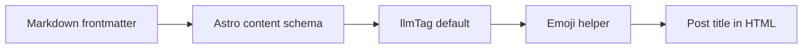

在上一篇关于博客主题和 `llms.txt` 的更新里，我顺手把这个站点变得更适合被大模型读取了一些：除了正常给人看的 HTML 页面之外，也给 posts 和 pages 留了一份原始 Markdown，并在根目录生成索引。那篇文章写到最后，其实已经有一点微妙的感觉：如果博客开始主动面向 LLM，那博客本身是不是也应该诚实地记录一下哪些内容是和 LLM 一起完成的？

于是就有了这次很小的改动：给每篇文章的 YAML frontmatter 加一个可选的 `llmTag` 字段，用来标记大模型参与写作的程度。

目前只有三个档位：

```yaml
llmTag: hand-written
llmTag: llm-assisted
llmTag: llm-driven
```

如果文章里没有这个字段，就默认是 `hand-written`。这对历史文章很重要，因为以前的文章大多是在没有 LLM 参与的时代写下来的，没必要为了新字段把所有旧 Markdown 都重新改一遍。需要标记的时候再显式加上即可。

这三个词的边界大概是这样的：

- `hand-written`：主要由人完成，大模型没有参与正文写作，或者只是在一些边角地方提供了帮助。
- `llm-assisted`：人仍然主导表达和结构，但大模型参与了润色、整理、补全或局部改写。
- `llm-driven`：文章主要由大模型根据人的意图、材料和反馈生成，人负责提出需求、审阅和决定是否发布。

对应到页面上，文章标题前面会多一个小 emoji：`✍️`、`🪄`、`🤖`。我最后给 `llm-assisted` 选了 `🪄`，原因也很简单：它看起来更像“帮了一把”，既不是纯手写，也还没有彻底变成机器人自动驾驶。`🤖` 留给更明确由模型驱动的内容，视觉上也比较直观。

这个标记只出现在网页可见标题里，不会进入 `<title>`、OG/Twitter metadata、JSON-LD、RSS/Atom、`llms.txt` 和原始 Markdown 导出。这样做是为了让它保持一个“面向读者的提示”，而不是污染各种机器可读的标题字段。毕竟标题本身还是标题，emoji 只是告诉读者这篇文章背后的生产方式。

实现本身没什么复杂的：Astro 的 content collection schema 里加一个 enum 默认值，然后在 blog 工具层放一个从 `llmTag` 到 emoji 的 helper，文章页和列表卡片复用这个 helper 渲染可见标题。相比起给每个组件都手写一遍映射，把这个逻辑集中起来以后，如果哪天觉得 `🪄` 太花哨，换成别的符号也不会到处找代码。



这件事有点像给文章贴一个“成分表”。以前大家默认博客文章都是作者自己写的，最多会注明转载、翻译或者引用。现在写作工具突然变得复杂了：有些文章仍然是人一点点敲出来的，有些是人列大纲后让模型扩写，有些则更像是人把需求和口味交给 agent，然后最后做验收。它们都可以是有价值的内容，但读者有权知道它们大概是怎么来的。

当然，三个标签不可能精确描述所有情况。写作不是二进制开关，实际过程更像一条连续的光谱：有时模型只是帮忙把一句话改得顺一点，有时它已经替你组织了段落，有时甚至连“应该写什么”都是在对话中一起长出来的。`llmTag` 不是为了审判文章纯度，而是提供一个足够轻量的上下文。

更有意思的是，这篇文章就是第一篇 `llm-driven` 的博客。它来自一个很直接的需求：和上一篇 `llms.txt` 的文章一样，写一篇博客描述这次变动，可以加一些必要背景和感想。这也算是这个字段的一次自举：一篇由 LLM 驱动生成的文章，在解释为什么博客需要标记 LLM 驱动的文章。

如果以后再回头看这批文章，也许能看到一个很具体的转折点：博客从“作者写给人看”，慢慢变成“作者、工具和读者共同参与的一块文本界面”。有些文章还是会认真手写，有些文章会被模型辅助整理，有些文章则直接交给 agent 先起草。区别它们不是为了制造等级，而是为了更坦诚地记录写作方式的变化。

毕竟事情已经在起变化了。既然连写博客这件小事都开始被大模型改变，那就在标题前面留一个小小的标记吧。
